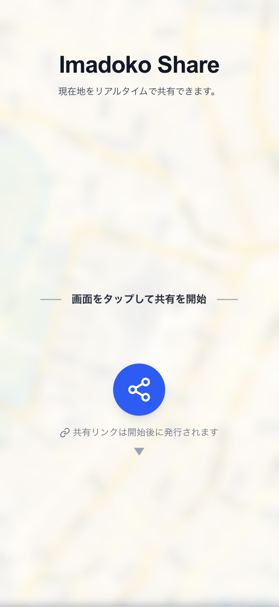
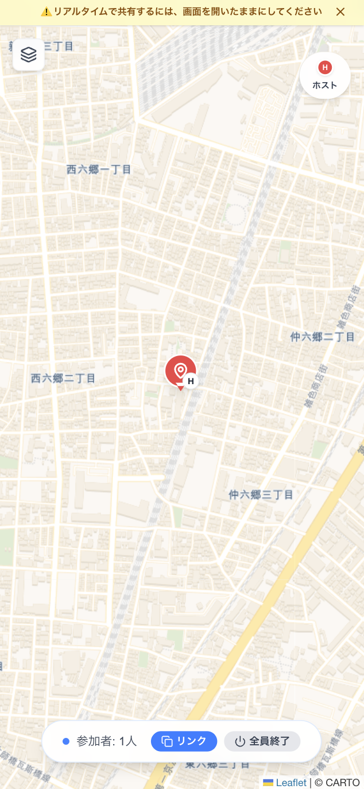
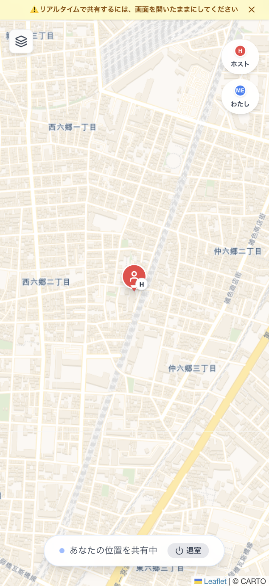

# imadoko

> リアルタイムで位置共有できる、シンプルで高速なWebアプリ

[](https://imadoko.vercel.app)


🌐 **Demo:** https://imadoko.vercel.app

## 📸 Screenshot

<p align="center">
   
   
   
</p>

---

## Overview

**imadoko** は、URLを共有するだけで現在地をリアルタイムに共有できるWebアプリです。  
アプリインストールやアカウント登録は不要で、すぐに使い始められます。

### 解決したい課題

- 「今どこ？」の確認に毎回メッセージを送る手間
- 待ち合わせ時の位置ズレ・行き違い
- 一時的に位置を共有したいが、常時共有はしたくない

---

## Demo

- **Live URL**: https://imadoko.vercel.app

### 動作イメージ

1. ホストが共有を開始
2. 共有URLをゲストへ送信
3. お互いの位置が地図上でリアルタイム更新
4. 退出/終了でセッションを即時停止

---

## Features

- ✅ URL共有だけで開始できる位置共有セッション
- ✅ ホスト/ゲスト間のリアルタイム双方向位置表示
- ✅ セッション単位の一時共有（使い捨て運用）
- ✅ 参加/退出の即時反映（リロード不要）
- ✅ 地図スタイル切り替え
- ✅ 参加者識別（カラー + バッジ）
- ✅ 位置情報エラー時のガイド表示
- ✅ ホスト終了時の明示的な終了通知

---

## Tech Stack

### Frontend

- Next.js 15 (App Router)
- React 19
- TypeScript
- Tailwind CSS v4
- Leaflet / React-Leaflet
- Lucide React

### Backend

- Supabase (Database + Realtime)
- Next.js Route Handlers (API)

### Infrastructure

- Vercel (Hosting / Deployment)

---

## Architecture

`imadoko` は **クライアント中心 + Realtime同期** の構成です。

- クライアントが `Geolocation API` で位置を取得
- `Supabase` の `session_participants` テーブルへ更新
- `Supabase Realtime` の変更通知を各端末が購読
- 各端末で地図ピンを更新・補間表示

```text
Browser (Host/Guest)
   ├─ Geolocation API
   ├─ Next.js UI (Map / Session UI)
   └─ Supabase Realtime Subscriber
                │
                ▼
         Supabase (Postgres)
         - sessions
         - session_participants
```

---

## Setup

### 1) Clone

```bash
git clone https://github.com/miiiwa1121/imadoko.git
cd imadoko
```

### 2) Install

```bash
npm install
```

### 3) Run (dev)

```bash
npm run dev
```

Open: http://localhost:3000

---

## Environment Variables

`.env.local` を作成し、以下を設定してください。

```env
NEXT_PUBLIC_SUPABASE_URL=your_supabase_project_url
NEXT_PUBLIC_SUPABASE_ANON_KEY=your_supabase_anon_key
```

> `NEXT_PUBLIC_*` はブラウザ側で参照されるため、Supabase側のRLSポリシー設定は必須です。

---

## UX Design

imadoko のUX設計は次を重視しています。

- **Zero-friction start**: すぐ始められる（登録不要）
- **Real-time clarity**: 状態変化がわかる（参加/退出/終了）
- **Low cognitive load**: 迷わない導線（タップ開始、シンプルUI）
- **Trust & privacy**: 一時共有・セッション終了で停止
- **Smooth motion**: ピン移動を補間し違和感を軽減

---

## Future Work

- [ ] 共有リンクの有効期限設定
- [ ] バッテリー最適化（送信間隔の動的制御）
- [ ] 通知/接続状態インジケータの強化
- [ ] 多言語対応（i18n）
- [ ] PWA対応
- [ ] E2Eテスト整備（Playwright等）

---

## License

This project is licensed under the **MIT License**.
